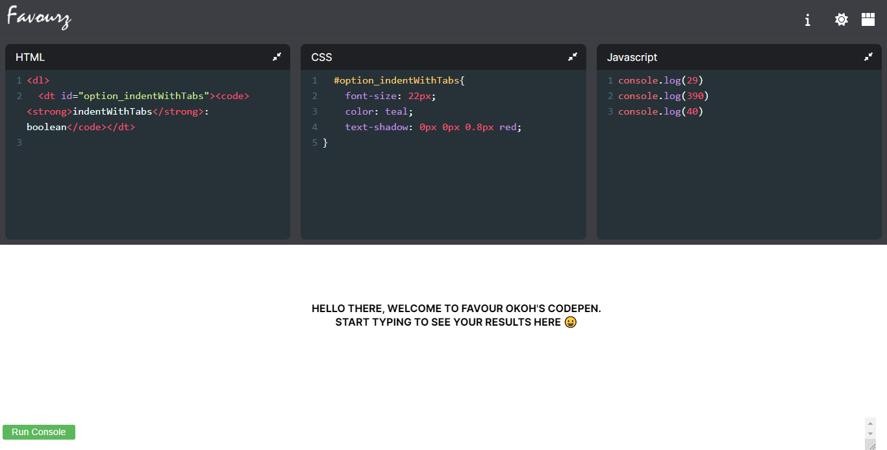

# Codepen Clone
This projects aims at re-creating the popular [Codepen](https://codepen.io/) with all of its functionality

Find it live [here]()

The project allows users to:

* Write HTML, CSS and Javascipt Code
* See the live results in the results pane
* View and log elements or variables to the console terminal, which can be activated by the ```Run Console``` button in the bottom right of the application
* Toggle the view of the application and alter where the editor/results will be positioned
* Toggle dark mode

## 📝 Table of Contents
- [Title and Description](#title)
- [Getting Started](#getting_started)
- [Screenshots](#screenshots)
- [Features](#features)
- [Built with](#built_with)
- [License](license)
- [Contributing](./CONTRIBUTING.md)
- [About Me](#about-me)

## 🏁 Getting Started

These instructions will get you a copy of the project up and running on your local machine for development and testing purposes.

### Prerequisites
You will need node version ```16.16.0``` and npm version ```8.11.0``` or higher to lauch the project.

Refer to [NodeJs website](https://nodejs.org/en/download) for more instructions.

### Installing
Step by step process to get the project running on your local machine after the [prerequistes](#prerequistes) have been completed.

Open your command terminal in the root directory of the project.


Clone the project

```bash
  git clone https://github.com/Favourz1/Codepen-clone.git
```

Go to the project directory

```bash
  cd Codepen-clone
```


Installing dependencies

```
npm install
```

Starting local server

```
npm run codepen-clone
```

The devlopment files are stored in the ```./src/``` folder.
## 🖥 Sceenshots 

<!-- <p align="center">
  <a href="" rel="noopener">
 </a>
</p> -->
## ⛓ Features 

- Light/dark mode toggle
- Live previews
- Fullscreen mode
- Console terminal
- Cross platform

## ⛏️ Built With

- 
- 
- 
- 
- 
- 
- 
- 
- 
## License

[](https://choosealicense.com/licenses/mit/)


## Contributing

Contributions are always welcome!

See `contributing.md` for ways to get started.

Please adhere to this project's code of conduct.


# Hi, I'm  Favour Okoh! 👋


## 🚀 About Me
I'm a passionate and innovative Software Engineer with strong collaboration skills.

My portfolio on:

[](https://www.linkedin.com/in/favour-okoh/)


Reach me on: 

[](https://twitter.com/_favourz)